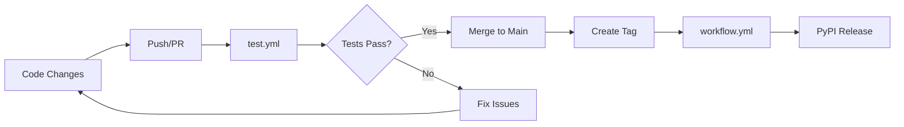

# 🔧 GitHub Workflows & Automation

This directory contains GitHub Actions workflows for the XandAI CLI project.

## 📋 Workflows Overview

### 1. `workflow.yml` - PyPI Publishing
**Triggers:** Tag creation (`v*.*.*`), Manual dispatch  
**Purpose:** Build, test, and publish releases to PyPI

**Stages:**
- ✅ **Test:** Multi-version testing (Python 3.8-3.11)
- 📦 **Build:** Create distribution packages  
- 🚀 **Publish:** Upload to PyPI (tags only)
- 📝 **Release:** Create GitHub release with assets

### 2. `test.yml` - Continuous Integration  
**Triggers:** Push to main/develop, Pull requests  
**Purpose:** Continuous testing and quality checks

**Features:**
- Multi-version testing
- Code quality (flake8, black, isort)
- Type checking (mypy)
- Coverage reporting
- Installation testing

## 🚀 Quick Start

### Making a Release

1. **Update version** in `setup.py`:
   ```python
   version="2.1.1"
   ```

2. **Create and push tag**:
   ```bash
   git tag v2.1.1
   git push origin v2.1.1
   ```

3. **Monitor workflow** in Actions tab

4. **Verify release** on [PyPI](https://pypi.org/project/xandai/)

### Required Secrets

Add these to repository settings:

| Secret | Description |
|--------|-------------|
| `PYPI_API_TOKEN` | PyPI API token for publishing |
| `TEST_PYPI_API_TOKEN` | Test PyPI token (optional) |

## 📚 Documentation

- 📖 **[Complete Release Guide](PYPI_RELEASE_GUIDE.md)** - Detailed setup and release process
- 🔍 **[Troubleshooting](PYPI_RELEASE_GUIDE.md#-troubleshooting)** - Common issues and solutions
- 🔒 **[Security Guide](PYPI_RELEASE_GUIDE.md#-security-best-practices)** - Best practices

## 🎯 Workflow Features

### Quality Assurance
- ✅ Multi-version Python testing
- 🔍 Code linting and formatting
- 📊 Coverage reporting  
- 🧪 Installation testing

### Security
- 🔐 Token-based authentication
- 🛡️ Environment protection rules
- 📝 Audit logs via GitHub Actions

### Automation
- 🚀 One-command releases
- 📦 Automatic package building
- 📝 Release notes generation
- 🎯 Asset management

## 🔄 Development Workflow



## 🏷️ Badge Status

Add these badges to your main README:

```markdown


[](https://badge.fury.io/py/xandai)
```

## 🔧 Customization

### Adding Steps
Add new steps to existing workflows:
```yaml
- name: Custom Step
  run: |
    echo "Custom command here"
```

### Environment Variables
Configure project-specific variables:
```yaml
env:
  CUSTOM_VAR: "value"
```

### Matrix Testing
Extend Python versions:
```yaml
strategy:
  matrix:
    python-version: ["3.8", "3.9", "3.10", "3.11", "3.12"]
```

---

**Need help?** Check the [Release Guide](PYPI_RELEASE_GUIDE.md) or create an issue!
