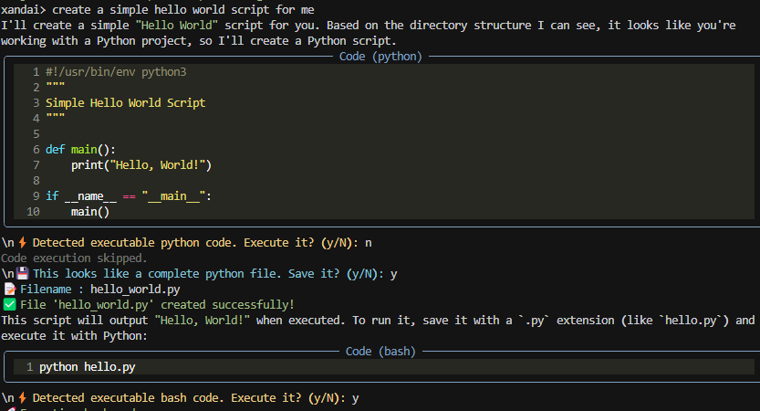

# XandAI - Production-Grade CLI Assistant

[](https://github.com/XandNet/XandAI-CLI/actions/workflows/test.yml)
[](https://github.com/XandNet/XandAI-CLI/actions/workflows/workflow.yml)
[](https://badge.fury.io/py/xandai)
[](https://opensource.org/licenses/MIT)
[](https://www.python.org/downloads/)

A sophisticated CLI assistant that integrates with Ollama models, featuring terminal command interception, context tracking, and structured project planning.

## 🚀 Key Features

- **Interactive REPL**: Rich terminal interface with intelligent autocomplete and history
- **Terminal Command Integration**: Execute system commands (ls, cd, cat, etc.) with wrapped output
- **Context Usage Tracking**: Real-time monitoring of token usage and context limits
- **Chat Mode**: Natural language conversations with persistent context
- **Task Mode**: Structured project planning with ordered, executable steps
- **File History Tracking**: Prevents duplicate files and maintains project consistency
- **Framework Detection**: Automatically detects and maintains project patterns

## 📸 Interface Preview



*XandAI CLI in action: Interactive terminal with command recognition, syntax highlighting, and intelligent autocomplete*

## 📦 Installation

```bash
# Install from PyPI (recommended)
pip install xandai

# Or install from source
git clone https://github.com/XandNet/XandAI-CLI.git
cd XandAI-CLI
pip install -e .

# Or install dependencies manually
pip install -r requirements.txt
```

### Quick Start

```bash
# Start XandAI CLI
xandai

# Use custom Ollama server  
xandai --endpoint http://192.168.1.10:11434

# Specify model directly
xandai --model llama3.2
```

## 🎯 Usage

### Basic Usage
```bash
# Start interactive REPL
xandai

# Use custom Ollama server
xandai --endpoint http://192.168.1.10:11434

# Specify model directly
xandai --model llama3.2
```

### Interactive Examples

The XandAI CLI provides seamless integration between AI assistance and terminal commands:

```bash
# Start XandAI CLI
xandai> python app.py
$ python app.py
[Command executed locally with wrapped output]

xandai> cd "My Project Folder"
Changed directory from C:\Users\user to C:\Users\user\My Project Folder

xandai> How can I optimize this Flask route for better performance?
[AI analyzes your code and provides optimized suggestions]

xandai> /task create a REST API with authentication
[Structured task breakdown with implementation steps]
```

### Chat Mode Features
```bash
# Natural language questions
> How do I optimize this Python function?

# Terminal commands (executed locally)
> ls -la
> cat app.py
> cd /path/to/project

# Task planning
> /task create a Flask API with authentication
```

### Task Mode Output Format
```
1 - create app.py
2 - edit requirements.txt
3 - run: pip install flask

<code edit filename="app.py">
# Complete file content here
</code>

<commands>
pip install flask
python app.py
</commands>
```

## 🏗️ Architecture

```
xandai/
├── main.py           # CLI entry point with argparse
├── chat.py           # Interactive REPL with terminal command handling
├── task.py           # Task mode with structured project planning
├── ollama_client.py  # Enhanced Ollama client with context tracking
├── history.py        # Conversation and file history management
└── utils/            # Display utilities and helpers
```

### Key Components

- **main.py**: Production-ready CLI with argument parsing and initialization
- **chat.py**: Rich REPL interface using prompt_toolkit with command completion
- **ollama_client.py**: Native Ollama API integration with context usage calculation
- **history.py**: Intelligent tracking of conversations, files, and project context
- **task.py**: Structured task planning with consistency checking

## 🔧 Special Features

### Terminal Command Integration
Execute any terminal command directly in chat:
```bash
> ls -la
> cd my-project
> cat requirements.txt
> grep -r "TODO" .
```
Results are wrapped in `<commands_output>` tags for LLM context.

### Context Usage Display
Every LLM response shows token usage:
```
Context usage: 45.2% (1847/4096)
```

### Project Consistency & File Specifications
- Tracks all file edits to prevent duplicates
- Maintains framework consistency (Flask, React, etc.)
- Suggests edits vs. creates for existing files
- Preserves project structure and patterns
- **Detailed File Specifications**: Each file includes purpose, functions, and exports
- **Framework-Specific Patterns**: Tailored expectations for Flask, Express, React
- **Import Consistency**: Validates all imports reference existing/planned files
- **Complete Implementations**: Ensures all specified functions are implemented

### Rich Terminal Experience
- Syntax-highlighted code blocks with language detection
- **Visual Interface**: Clean, modern terminal UI as shown in the preview above
- **Intelligent Autocomplete**: Context-aware suggestions for commands and file paths
- Command completion and history with fuzzy matching
- Colored output with Rich library for better readability
- Status indicators and progress bars for long-running operations
- **Command Recognition**: Seamlessly switches between AI chat and terminal commands

### Intelligent Autocomplete System
XandAI features a smart autocomplete that provides context-aware suggestions:

**Command-Specific Completions:**
```bash
# Directory commands (cd, mkdir) - shows only directories
xandai> cd [TAB] → src/, docs/, tests/

# File commands (cat, edit) - shows only files  
xandai> cat [TAB] → README.md, app.py, config.json

# Mixed commands (ls, cp) - shows files and directories
xandai> ls [TAB] → src/, README.md, package.json

# Slash commands
xandai> /[TAB] → /task, /help, /status, /clear
```

**Supported Commands:**
- **Directory only**: `cd`, `mkdir`, `rmdir`, `pushd`, `popd`
- **File only**: `cat`, `type`, `edit`, `nano`, `vim`, `head`, `tail`
- **Both**: `ls`, `dir`, `cp`, `mv`, `rm`, `del`, `find`, `grep`

Use **Tab** to show suggestions, **↑/↓** arrows to navigate, **Enter** to select.

### File Consistency & Detailed Specifications
XandAI now generates comprehensive file specifications to ensure code consistency:

**Enhanced Structure Planning:**
```bash
xandai> /task create a Flask API with authentication

Flask Project:
├── app.py              # Main Flask application entry point
│                       # Functions: create_app(), register_blueprints()
│                       # Exports: app (Flask instance)
├── models/
│   └── user.py         # User model and authentication
│                       # Classes: User(db.Model)  
│                       # Functions: hash_password(), check_password()
│                       # Exports: User class
├── routes/
│   └── auth.py         # Authentication routes (/login, /register)
│                       # Functions: login(), register(), logout()
│                       # Exports: auth_bp (Blueprint)
└── config.py           # Application configuration
                        # Classes: Config, DevelopmentConfig
                        # Exports: config classes
```

**Benefits:**
- **Complete Implementations**: Every function and export is specified and implemented
- **Import Consistency**: All imports reference only existing or planned files
- **Framework Patterns**: Follows Flask, Express, React best practices automatically
- **Production Ready**: Generated code includes error handling and documentation

## 🚀 Releases & Publishing

XandAI is automatically published to PyPI using GitHub Actions. New releases are triggered by creating tags:

```bash
# Create a new release
git tag v2.1.1
git push origin v2.1.1
```

This triggers:
- ✅ Automated testing across Python 3.8-3.11
- 📦 Package building and validation
- 🚀 Publishing to PyPI
- 📝 GitHub release creation

**Latest Release:** Check [PyPI](https://pypi.org/project/xandai/) or [GitHub Releases](https://github.com/XandNet/XandAI-CLI/releases)

## 🤝 Contributing

This project follows clean code standards, modular architecture, and comprehensive error handling for production-grade reliability.

### Development Setup

```bash
# Clone repository
git clone https://github.com/XandNet/XandAI-CLI.git
cd XandAI-CLI

# Install in development mode
pip install -e .

# Install development dependencies
pip install pytest flake8 black isort

# Run tests
pytest

# Check code quality
flake8 .
black --check .
isort --check-only .
```

All contributions are automatically tested via GitHub Actions before merging.
