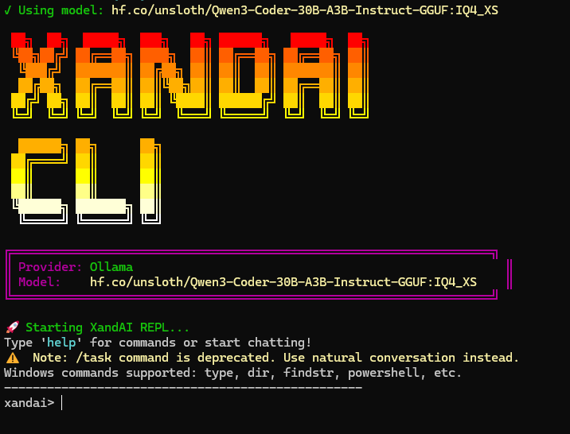
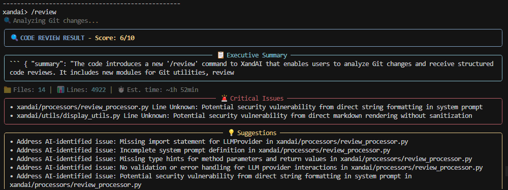

<div align="center">

  # XandAI CLI

  [](https://github.com/XandAI-project/Xandai-CLI/actions/workflows/test.yml)
  [](https://pypi.org/project/xandai-cli/)
  [](https://opensource.org/licenses/MIT)

  Terminal assistant that combines AI chat with command execution. Supports Ollama and LM Studio.
</div>


## Installation

```bash
pip install xandai-cli
xandai --auto-detect
```

## Usage

```bash
# Terminal commands
xandai> ls -la
xandai> git status

# AI questions  
xandai> How do I optimize this code?

# Natural conversation for any task
xandai> create a REST API with authentication

# Git AI commands (run outside REPL)
xandai commit              # Generate commit message from staged changes
xandai pr                  # Summarize pull request
xandai diff                # Explain diff in plain English
xandai blame --file main.py --line 42  # Explain why a line exists
```

## Providers

- **Ollama** - Local models
- **LM Studio** - GUI-based model management

```bash
xandai --provider ollama
xandai --provider lm_studio --endpoint http://localhost:1234
```

## New in Phase 2 🎉

XandAI Phase 2 adds enterprise-grade features for professional development workflows:

**Agent Workflows** - Multi-step task execution with planning and tracking
**Session Management** - Persistent conversations with full history
**Context Management** - Smart token management for any model
**Memory System** - Long-term knowledge retention
**Web Integration** - Enhanced web content fetching and extraction
**File Watching** - Real-time project monitoring
**CLI Enhancement** - OpenCode-style structured commands

See [README_PHASE2.md](README_PHASE2.md) for detailed documentation.

## Commands

```bash
# Core Commands
/agent <instruction>  # Multi-step LLM orchestrator for complex tasks
/set-agent-limit <n>  # Set max LLM calls (default: 20, max: 100)
/review               # AI-powered code review
/lsp                  # Language Server Protocol integration (code intelligence)
/web on               # Enable web content integration
/host [addr] -p 4800  # Start web shell server (real-time web interface)
/help                 # Show all commands
/clear                # Clear history
/status               # System status

# Session Commands (Phase 2)
xandai session new               # Create new session
xandai session list              # List all sessions
xandai session load <id>         # Load session
xandai session export <id> <file> # Export session

# Agent Commands (Phase 2)
xandai agent run <task>          # Run multi-step task
xandai agent status              # Check task status
xandai agent list                # List all tasks

# Project Commands (Phase 2)
xandai project watch start       # Start file watching
xandai project watch stop        # Stop file watching
```

### Web Shell

Access XandAI through a web browser with real-time interaction:

```bash
# Start web shell server
xandai> /host 0.0.0.0 -p 4800

# Open browser at http://localhost:4800
# Interact with XandAI through a modern web interface
# Terminal and web interface work simultaneously
```

Features:
- Real-time communication using WebSocket
- Modern terminal-like interface
- Execute all XandAI commands through browser
- Accessible from any device on your network
- Works alongside the terminal interface

### Agent Mode

The `/agent` command is a powerful multi-step LLM orchestrator that chains multiple AI calls to handle complex tasks:

```bash
# Fix code with systematic analysis
/agent fix the bug in main.py where the loop never terminates

# Complex refactoring
/agent refactor this monolithic code into modular components

# Detailed explanations
/agent explain how the authentication system works
```

**Pipeline stages:**
1. **Intent Analysis** - Classifies the task type
2. **Context Gathering** - Identifies needed information
3. **Task Execution** - Performs the main work
4. **Validation** - Verifies output quality
5. **Refinement** - Improves based on validation (if needed)

**When to use /agent:**
- Complex multi-step tasks
- Code requiring analysis and validation
- Tasks needing structured reasoning
- When quality matters more than speed

See [example/agent_demo.md](example/agent_demo.md) for detailed examples.

> **Note:** The `/task` command has been deprecated. Use natural conversation instead for better results.

## File Operations

XandAI can intelligently create and edit files with AI assistance:

### Creating Files

Simply ask to create a file with a specific name:

```bash
xandai> create tokens.py with authentication functions
# AI generates complete code
# System detects filename automatically
This looks like a complete python file. Save it? (y/N): y
Filename: tokens.py
File 'tokens.py' created successfully!
```

### Editing Files

Edit existing files by name:

```bash
xandai> edit index.py adding a health endpoint
# AI reads current file content
# Generates complete updated version
Edit file 'index.py'? (y/N): y
File 'index.py' updated successfully!
```

### Smart Detection

The AI automatically:
- Reads files when editing (preserves existing code)
- Extracts filenames from your request
- Provides complete file content (never placeholders)
- Only prompts when you explicitly request file operations

### Supported Formats

Works with any programming language:
```bash
xandai> create app.js with Express server
xandai> edit styles.css adding dark mode
xandai> create config.json with API settings
```

## Code Execution

XandAI can detect and execute code in various languages:

```bash
xandai> create a math.py that will receive two args and sum them
# AI generates complete Python script with argument handling
This looks like a complete python file. Save it? (y/N): y
Filename: math.py
File 'math.py' created successfully!

xandai> python math.py 2 2
$ python math.py 2 2
2.0 + 2.0 = 4.0
Command completed successfully
```

Features:
- Automatic code detection for Python, JavaScript, Bash, and more
- Interactive execution mode for scripts requiring input
- Non-interactive capture mode for automation
- Smart prompts for user choice between modes

## Code Review

AI-powered code review with Git integration. Analyzes your code changes and provides detailed feedback on security, quality, and best practices.

```bash
xandai> /review
# Automatically detects Git changes and provides comprehensive analysis
```



## Git AI Commands

AI-powered Git operations that run outside the REPL:

```bash
# Generate commit message from staged changes
git add .
xandai commit

# Summarize a pull request
xandai pr --base main --head feature-branch

# Explain diff in plain English
xandai diff
xandai diff --file src/app.py
xandai diff --commit-hash abc123

# Explain why a line exists (git blame)
xandai blame --file src/main.py --line 42
```

These commands use AI to:
- Generate descriptive commit messages from your staged changes
- Summarize pull requests with changes, risks, and impact
- Explain diffs in plain English instead of technical patch format
- Explain the purpose and history of specific lines of code

## Web Integration

Automatically fetches and analyzes web content when you paste links:

```bash
xandai> /web on
xandai> How does this work? https://docs.python.org/tutorial
# Content is automatically fetched and analyzed
```

## LSP Integration

Language Server Protocol integration provides real-time code intelligence and syntax validation:

```bash
xandai> /lsp on                # Enable LSP integration
xandai> /lsp                   # Show status and active servers
xandai> /lsp analyze main.py   # Analyze file for errors
```

Supports 15+ languages including Python, JavaScript, TypeScript, Rust, Go, Java, C/C++. Install LSP servers:

```bash
# Python-based servers
pip install -r requirements-lsp.txt

# All servers (interactive)
./scripts/install_lsp_servers.sh        # Linux/Mac
.\scripts\install_lsp_servers.ps1       # Windows

# Specific language
./scripts/install_lsp_servers.sh python
.\scripts\install_lsp_servers.ps1 javascript
```

Features:
- Automatic language detection
- Real-time diagnostics and error detection
- Type-aware code suggestions
- Project-specific conventions
- AI prompts enriched with LSP context

## Development

```bash
git clone https://github.com/XandAI-project/Xandai-CLI.git
cd Xandai-CLI
pip install -e .
xandai
```

## License

MIT
