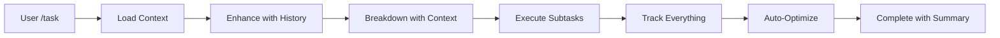

# Task Command Enhancements - Conversation Context Integration

## 🎯 Overview

The `/task` command has been significantly enhanced to leverage the robust conversation history system, providing intelligent context awareness, automatic token management, and comprehensive task tracking.

## ✨ Key Improvements Implemented

### 1. **Robust Conversation Integration**

#### **Automatic History Initialization**
```python
# Initialize conversation integration automatically
conversation_integration = ConversationIntegration(api=self.api)
conversation_integration.set_model(self.selected_model)
```

#### **Context-Aware Task Breakdown**
- Uses conversation history to understand project context
- References previous work and decisions
- Maintains consistency with established patterns
- Builds upon existing knowledge

#### **Token Budget Management**
- Monitors context utilization in real-time
- Auto-summarizes when context exceeds 80% utilization
- Intelligent optimization prevents token overflow
- Model-specific limits and budgeting

### 2. **Enhanced Task Execution**

#### **Conversation Context for Each Subtask**
```python
# Each subtask gets fresh, optimized context
current_context = conversation_integration.get_context_for_prompt(max_tokens=3000)

task_prompt = f"""**CONVERSATION & PREVIOUS TASKS CONTEXT:**
{current_context}

**CURRENT SUBTASK:**
{task_prompt}

**CONTEXT INTEGRATION INSTRUCTIONS:**
- Build upon previous work and decisions from the conversation history
- Maintain consistency with established patterns and coding style
- Reference and extend existing implementations when relevant
- Avoid duplicating work already completed in previous subtasks"""
```

#### **Comprehensive Task Tracking**
- **Task Request**: Original user task added to history
- **Task Breakdown**: AI's breakdown analysis tracked
- **Execution Plan**: Complete plan logged for reference
- **Subtask Progress**: Each subtask start/completion tracked
- **AI Responses**: All responses captured (truncated for efficiency)
- **Error Handling**: Failures logged with context

#### **Intelligent Auto-Summarization**
- Monitors context usage between subtasks
- Auto-summarizes at 85% utilization
- Maintains task continuity while freeing tokens
- Preserves essential context for remaining tasks

### 3. **New `/history` Command**

#### **Complete History Management**
```bash
/history                    # Show conversation status
/history export json        # Export to JSON format
/history export markdown    # Export to Markdown
/history export txt         # Export to plain text
/history summarize          # Force summarization
/history optimize           # Force context optimization
/history stats              # Detailed statistics
/history clear              # Clear history (with confirmation)
```

#### **Rich Statistics and Monitoring**
- Token usage and optimization metrics
- Summarization efficiency reports
- Message type breakdown
- Model-specific context information
- Performance analytics

### 4. **Seamless Integration**

#### **Automatic Model Configuration**
- Conversation integration auto-configures when model selected
- Token budgets adjusted for specific model capabilities
- Context limits respected per model family

#### **Backward Compatibility**
- Graceful fallback if conversation system unavailable
- Existing functionality preserved
- Progressive enhancement approach

## 🚀 Usage Examples

### **Complex Project Task with Context**
```bash
/task create a complete authentication system for my React app

# AI now understands:
# - Previous conversations about your React app
# - Existing code patterns and preferences  
# - Architecture decisions made earlier
# - Dependencies already discussed
```

### **Context-Aware Subtask Execution**
Each subtask now receives:
- **Full conversation history** relevant to the task
- **Previous subtask results** for building upon
- **Consistent coding patterns** from past work
- **Error context** from previous attempts

### **Automatic Token Management**
```
📚 Using conversation history (2,847 tokens)
⚠️ Context utilization high (82%) - may auto-summarize
📝 High context usage - auto-summarizing...
✓ Auto-summarized for efficiency
```

## 📊 Performance Benefits

### **Before Enhancement:**
- Tasks executed in isolation
- No memory of previous work
- Manual context management
- Token limits could cause failures
- Repetitive explanations

### **After Enhancement:**
- **Context-aware execution** - builds on previous work
- **Automatic token management** - prevents overflow
- **Rich history tracking** - full project memory
- **Intelligent summarization** - maintains efficiency
- **Consistent results** - follows established patterns

## 🔧 Technical Implementation

### **Core Components Integrated:**
1. **ConversationIntegration** - Bridge to robust history system
2. **TokenBudgetManager** - Model-specific token management
3. **ConversationSummarizer** - Intelligent auto-summarization
4. **HistoryManager** - Complete conversation tracking

### **Task Flow Enhanced:**


### **Context Integration Points:**
- **Task Request**: Added to conversation history
- **Task Breakdown**: AI analysis captured and contextualized
- **Subtask Execution**: Fresh context for each subtask
- **Response Capture**: All AI responses tracked efficiently
- **Error Handling**: Failures logged with full context
- **Completion Summary**: Comprehensive task completion record

## 🎉 Results

### **Intelligent Task Understanding**
Tasks now understand:
- ✅ **Project context** from conversation history
- ✅ **Previous decisions** and architecture choices
- ✅ **Coding patterns** and style preferences
- ✅ **Existing implementations** to build upon
- ✅ **Error history** to avoid repeated mistakes

### **Efficient Resource Management**
- ✅ **Automatic token budgeting** prevents context overflow
- ✅ **Smart summarization** maintains long-term memory
- ✅ **Model-specific optimization** for different LLMs
- ✅ **Context utilization monitoring** with real-time feedback

### **Comprehensive Project Memory**
- ✅ **Full conversation tracking** for complex projects
- ✅ **Rich export capabilities** for documentation
- ✅ **Detailed analytics** for optimization insights
- ✅ **Persistent history** across sessions

## 🔮 Future Enhancements

The foundation is now in place for:
- **Vector-based context search** for semantic similarity
- **Advanced summarization strategies** per conversation type
- **Integration with external documentation** systems
- **Multi-project conversation management**
- **Collaborative history sharing**

## 📝 Usage Recommendation

For optimal results with the enhanced `/task` command:

1. **Start conversations naturally** - the system learns from context
2. **Use `/history stats`** to monitor token usage
3. **Let auto-summarization work** - trust the token management
4. **Export important sessions** for future reference
5. **Use `/history optimize`** if context feels sluggish

The enhanced `/task` command transforms XandAI CLI from a basic task executor into an intelligent project assistant with full conversational memory and context awareness! 🚀
